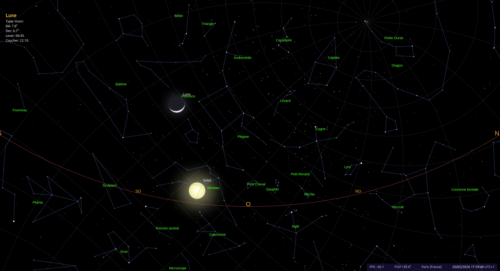
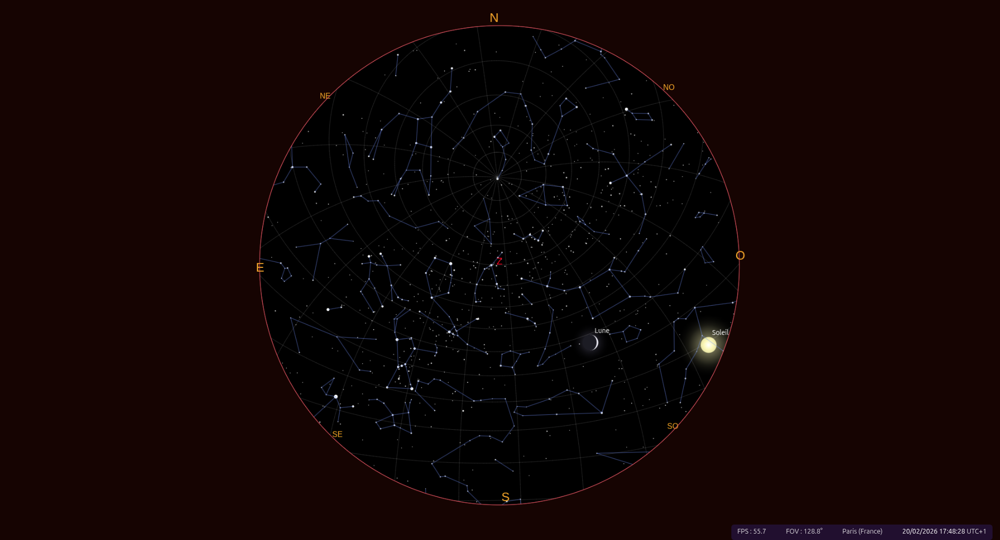

# Planetarium 2D

[](https://github.com/celio-mozes-rocha/planetarium-2D/actions)
[](https://github.com/celio-mozes-rocha/planetarium-2D/blob/main/LICENSE)
[](https://github.com/celio-mozes-rocha/planetarium-2D/commits/main)

Minimal 2D planetarium built with **React**, **TypeScript**, and **TailwindCSS**.  
The application is automatically deployed to a VPS using a **CI/CD pipeline with GitHub Actions and Docker**.

---

## Technical Notes

This project focuses on implementing core rendering logic directly with the HTML Canvas API rather than relying on higher-level 3D libraries such as Three.js.

While libraries like Three.js provide powerful abstractions for 3D rendering, this implementation intentionally explores lower-level concepts to better understand the mechanics typically handled by those frameworks.

Key learning areas:

- Coordinate transformations
- Projection logic (2D representation of spatial data)
- Object selection and interaction
- Rendering pipeline fundamentals
- Basic performance considerations

The current feature set remains intentionally minimal and serves as a foundation for experimentation. Performance optimizations and more advanced astronomical behaviors are planned for future iterations.

The objective is not to compete with full-featured 3D engines, but to build a solid understanding of the underlying rendering principles before introducing higher-level abstractions.

---

## Live Demo

[https://celio-mozes.fr/planetarium](https://celio-mozes.fr/planetarium)

---

## Preview





---

## Tech Stack

**Frontend**

- React
- TypeScript
- TailwindCSS
- Vite

**DevOps & Deployment**

- Docker (multi-stage build)
- GitHub Actions (CI/CD)
- Ubuntu VPS
- SSH key authentication
- Nginx (Docker container runtime)

---

## Architecture

**Git Workflow**


```
feature branch
↓
Pull Request
↓
Merge into dev
↓
Merge into main
↓
```

## Automatic Deployment


**CI/CD Deployment Flow**

1. Merge into `main` triggers GitHub Actions
2. Docker image is built in CI
3. Image is exported as a `.tar` artifact
4. Image is transferred securely to the VPS via SSH
5. VPS loads the image and restarts the container
6. Health check validates the deployment


GitHub → GitHub Actions → Docker Image → VPS → Nginx → Users


The VPS acts only as a **Docker runtime**.  
No source code or Node.js environment is required on the server.


## Docker

**Multi-stage Dockerfile**

- Stage 1: Build React app with Node
- Stage 2: Serve static files using Nginx (Alpine)

This ensures:
- Small production image
- No development dependencies in production
- Clean separation between build and runtime

**Run locally with Docker**

```bash
docker build -t planetarium .
docker run -p 8080:80 planetarium
```

Then open:

```
http://localhost:8080
```

## Local Development

```bash
git clone https://github.com/celio-mozes-rocha/planetarium-2D.git
cd planetarium-2D
npm install
npm run dev
```
## Production Build (without Docker)

```bash
npm run build
npm run preview
```

## Continuous Deployment

Deployment is automatically triggered when a Pull Request is merged into the `main` branch.

The workflow:
- Builds Docker image in CI
- Transfers image via SSH
- Restarts container
- Performs post-deployment health check

This ensures:

- Reproducible builds
- Immutable deployment artifacts
- No manual intervention

## Security

- SSH key authentication
- Secrets stored in GitHub Actions
- No direct source code on VPS
- Container restart strategy with --restart unless-stopped

## Project Goals

This project was built to:

- Practice advanced React + TypeScript patterns
- Understand Docker multi-stage builds
- Implement a real CI/CD pipeline
- Deploy and manage a production VPS environment
- Follow a structured Git workflow