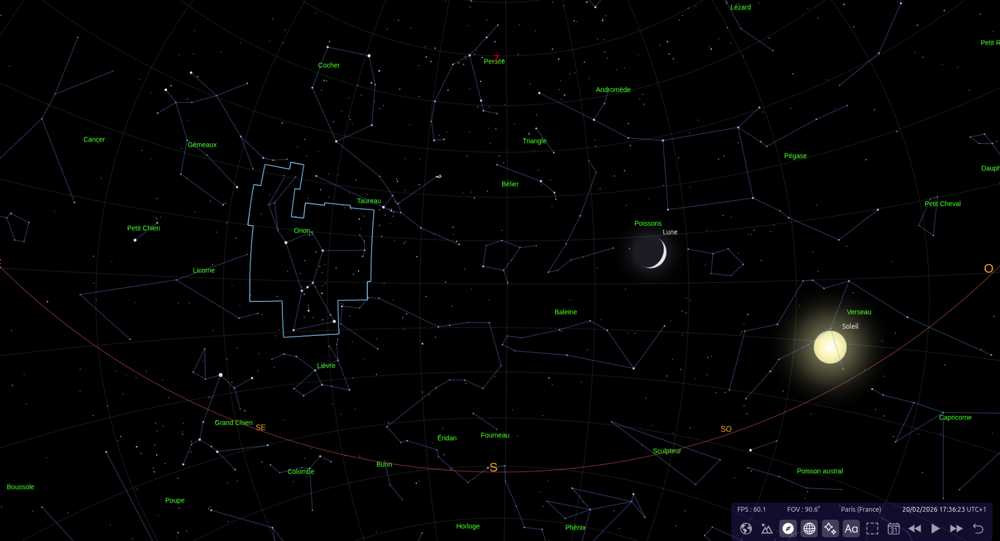
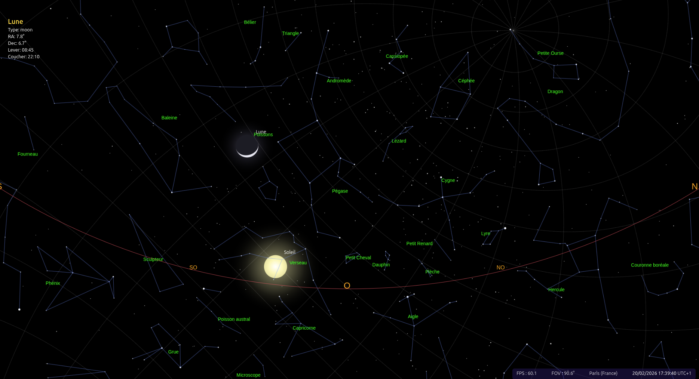
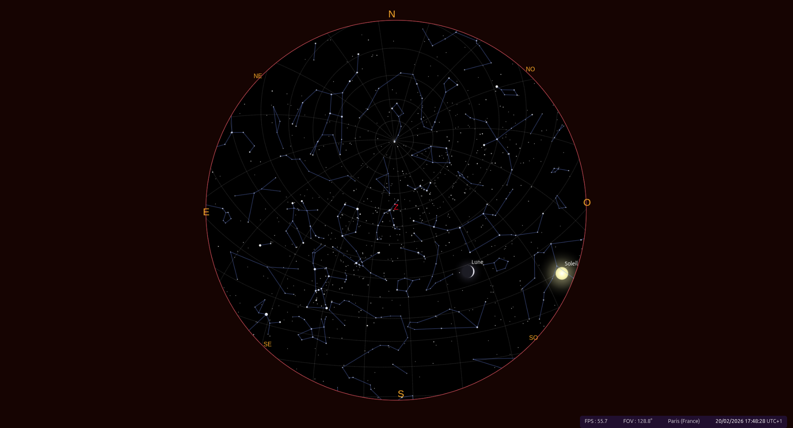
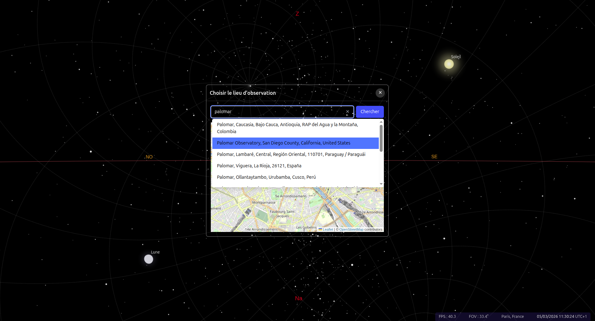

# Planetarium 2D (Nebula light)

[](https://github.com/celio-mozes-rocha/planetarium-2D/actions)
[](https://github.com/celio-mozes-rocha/planetarium-2D/blob/main/LICENSE)
[](https://github.com/celio-mozes-rocha/planetarium-2D/commits/main)

Minimal 2D planetarium built with **React**, **TypeScript**, and **TailwindCSS**.  
The application is automatically deployed to a VPS using a **CI/CD pipeline with GitHub Actions and Docker**.

---

## Technical Notes

This project focuses on implementing core rendering logic directly with the HTML Canvas API rather than relying on higher-level 3D libraries such as Three.js.

While libraries like Three.js provide powerful abstractions for 3D rendering, this implementation intentionally explores lower-level concepts to better understand the mechanics typically handled by those frameworks.

Key learning areas:

- Coordinate transformations
- Projection logic (2D representation of spatial data)
- Object selection and interaction
- Rendering pipeline fundamentals
- Basic performance considerations

The current feature set remains intentionally minimal and serves as a foundation for experimentation. Performance optimizations and more advanced astronomical behaviors are planned for future iterations.

The objective is not to compete with full-featured 3D engines, but to build a solid understanding of the underlying rendering principles before introducing higher-level abstractions.

---

## Live Demo

[https://planetarium.celio-mozes.fr](https://planetarium.celio-mozes.fr)

---

## Preview





---

## Tech Stack

**Frontend**

- React
- TypeScript
- TailwindCSS
- Vite

**Backend**

- Node.js
- Express
- TypeScript
- OpenStreetMap Nominatim API

**DevOps & Deployment**

- Docker (multi-container architecture)
- Docker Compose
- GitHub Actions (CI/CD)
- Ubuntu VPS
- SSH key authentication
- Nginx (reverse proxy)

---

## Architecture

**Git Workflow**


```
feature branch
↓
Pull Request
↓
Merge into dev
↓
Merge into main
↓
```

## Automatic Deployment


**CI/CD Deployment Flow**

1. Merge into `main` triggers GitHub Actions
2. Docker image (frontend and backend) are built in CI
3. Images are exported as a `.tar` artifact
4. Images are transferred securely to the VPS via SSH
5. VPS loads the images
6. Docker compose restarts the services
7. Health check validates the deployment


GitHub → GitHub Actions → Docker Images → VPS → Docker compose → Nginx Reverse proxy → Users


The VPS acts only as a **Docker runtime**.  
No source code or Node.js environment is required on the server.


## Application Architecture

The application follows a simple **frontend / backend architecture**.

Frontend requests are routed through **Nginx**, which serves the static React application and proxies API requests to the backend service.

```
User
↓
Nginx (reverse proxy)
↓
React frontend
↓
/api
↓
Node.js backend
↓
OpenStreetMap Nominatim PAI
```


### Components

**Frontend**
- React application
- HTML Canvas based sky rendering
- UI interaction and search interface

**Backend**
- Express API
- Proxy for OpenStreetMap Nominatim requests
- Handles geolocation search

**Nginx**
- Serves static frontend files
- Reverse proxy for `/api` routes


## Docker

The project uses **two Docker images** orchestrated with **Docker Compose**.

### Frontend container

- Multi-stage build
- React app compiled with Node
- Static files served by Nginx

### Backend container

- Node.js + Express API
- Built from TypeScript source
- Exposes REST endpoint `/api/search`

### Nginx Reverse Proxy

Nginx serves the frontend and forwards API calls:
- /api/* → backend:3310
This allows the frontend to call the backend using **relative URLs** without exposing internal services.
---

**Run locally with Docker**

```bash
docker compose -f docker-compose.dev.yml up --build
```

Once the containers are running, open:

```
http://localhost:5173
```
The development environment uses the Vite dev server with hot reload enabled.

Services started

frontend → Vite development server

backend → Node.js / Express API

API requests from the frontend are proxied to the backend through the Vite development server

## Local Development

```bash
git clone https://github.com/celio-mozes-rocha/planetarium-2D.git
cd planetarium-2D
npm install
npm run dev
```
## Production Build (without Docker)

```bash
npm run build
npm run preview
```

## Continuous Deployment

Deployment is automatically triggered when a Pull Request is merged into the `main` branch.

The workflow:
- Builds Docker image in CI
- Transfers image via SSH
- Restarts container
- Performs post-deployment health check

This ensures:

- Reproducible builds
- Immutable deployment artifacts
- No manual intervention

## Security

- SSH key authentication
- Secrets stored in GitHub Actions
- No direct source code on VPS
- Container restart strategy with --restart unless-stopped

## New feature - Location Search
The application includes a location search feature allowing users to select a place on Earth and update the sky view accordingly.

Workflow:

1. The user searches for a location (city, place, etc.)
2. The frontend sends a request to /api/search
3. The backend queries the OpenStreetMap Nominatim API
4. Results are returned to the frontend
5. The sky map updates using the selected coordinates

This architecture provides several advantages:

- External API calls are handled by the backend
- The frontend uses a simple /api endpoint

## Project Status

This project is under active development.
Features are intentionally minimal and focused on experimentation and learning.

## Project Goals

This project was built to:

- Practice advanced React + TypeScript patterns
- Understand Docker multi-stage builds
- Implement a real CI/CD pipeline
- Deploy and manage a production VPS environment
- Follow a structured Git workflow

## License

This project is licensed under the MIT License - see the LICENSE file for details.